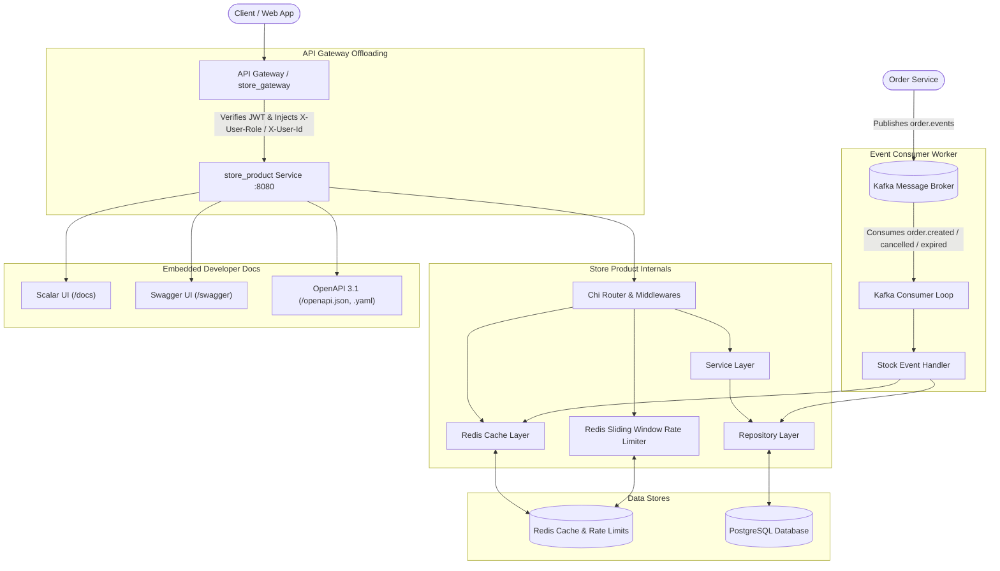

# Store Product Microservice

High-performance e-commerce Product Catalog and Variant Management Microservice. Built with **Go (Chi router)**, **PostgreSQL (Prisma Client Go)**, and **Redis**.

---

## Architecture Overview

The `store_product` service operates as a backend microservice within an e-commerce ecosystem. It leverages API Gateway offloading for authentication and utilizes Redis for caching and sliding-window rate limiting.



### Core Design Principles

1. **API Gateway Offloading**: Admin mutation endpoints enforce verified headers (`X-User-Role`, `X-User-Id`) injected upstream by the API Gateway (`store_gateway`), avoiding redundant JWT decoding across microservices.
2. **Event-Driven Inventory Synchronization**: Consumes Kafka topic `order.events` (`order.created`, `order.cancelled`, `order.expired`) to execute atomic stock deductions and restocking with database idempotency tracking (`processed_events`).
3. **Multi-layer Redis Caching**: High-traffic public catalog queries and product detail lookups are cached with automatic multi-level invalidation on product or variant updates.
4. **Sliding-Window Rate Limiting**: In-memory Redis sliding-window algorithm tracks and enforces request quotas across public catalog, search, and admin endpoints with standard `X-RateLimit-*` headers.
5. **Keyset Cursor Pagination**: Public product listings utilize O(1) keyset cursor pagination (`nextCursor`, `hasMore`) for stable performance at scale.
6. **Self-Documenting Binary**: OpenAPI 3.1.0 specifications and interactive documentation interfaces (Scalar UI and Swagger UI) are embedded directly into the Go application binary.

---

## Tech Stack

- **Language**: Go 1.22+
- **HTTP Framework**: [go-chi/chi/v5](https://github.com/go-chi/chi)
- **Database & ORM**: PostgreSQL / Supabase via [Prisma Client Go](https://github.com/steebchen/prisma-client-go)
- **Cache & Rate Limiting**: [go-redis/v9](https://github.com/redis/go-redis)
- **Event Streaming**: [segmentio/kafka-go](https://github.com/segmentio/kafka-go)
- **API Documentation**: OpenAPI 3.1.0, [Scalar UI](https://scalar.com), and [Swagger UI](https://swagger.io/tools/swagger-ui/)

---

## Prerequisites

- **Go**: `1.22` or later
- **PostgreSQL**: `14` or later (or Supabase instance)
- **Redis**: `7.0` or later (default port `6379`)
- **Docker**: (Optional) For containerized deployment

---

## Environment Configuration

Configuration is loaded from environment variables (or an optional `.env` file via `godotenv`).

Copy the template to create your local `.env`:

```bash
cp .env.example .env
```

### Configuration Variables

| Variable | Type | Default | Description |
| :--- | :--- | :--- | :--- |
| `PORT` | `string` | `8080` | HTTP server listening port |
| `ENV` | `string` | `development` | Runtime environment (`development`, `production`, `test`) |
| `DATABASE_URL` | `string` | *(Required)* | PostgreSQL connection URI |
| `REDIS_HOST` | `string` | `localhost` | Redis server hostname or IP address |
| `REDIS_PORT` | `string` | `6379` | Redis server port |
| `REDIS_PASSWORD` | `string` | *(Empty)* | Redis authentication password |
| `REDIS_DB` | `int` | `0` | Redis logical database index |
| `RATE_LIMIT_PUBLIC_RPM` | `int` | `120` | Requests per minute for public catalog queries |
| `RATE_LIMIT_SEARCH_RPM` | `int` | `60` | Requests per minute for search endpoints |
| `RATE_LIMIT_ADMIN_RPM` | `int` | `30` | Requests per minute for admin mutation endpoints |
| `KAFKA_BROKERS` | `string` | `localhost:9092` | Comma-delimited Kafka broker bootstrap addresses |
| `KAFKA_TOPIC_ORDER_EVENTS` | `string` | `order.events` | Kafka topic for order lifecycle events (`created`, `cancelled`, `expired`) |
| `KAFKA_CONSUMER_GROUP` | `string` | `store_product_stock_worker` | Kafka consumer group identifier for inventory synchronization |
| `R2_ACCOUNT_ID` | `string` | *(Empty)* | Cloudflare R2 Account ID for S3 endpoint construction |
| `R2_ACCESS_KEY_ID` | `string` | *(Empty)* | Cloudflare R2 / S3-compatible Access Key ID |
| `R2_SECRET_ACCESS_KEY` | `string` | *(Empty)* | Cloudflare R2 / S3-compatible Secret Access Key |
| `R2_BUCKET_NAME` | `string` | `store-products` | Cloudflare R2 target bucket name |
| `R2_PUBLIC_BASE_URL` | `string` | `https://cdn.mystore.com` | Public CDN base URL or r2.dev subdomain for media delivery |

---

## Quick Start & Local Development

### 1. Clone & Install Dependencies

```bash
git clone https://github.com/Sall-lah/store_product.git
cd store_product
go mod download
```

### 2. Configure Environment

Create `.env` based on `.env.example`:

```bash
cp .env.example .env
```

Ensure your PostgreSQL database and Redis instances are running and update `DATABASE_URL` and `REDIS_HOST`/`REDIS_PORT` accordingly.

### 3. Run the Service

```bash
go run cmd/server/main.go
```

The server starts on `http://localhost:8080`.

### 4. Health Check Verification

```bash
curl http://localhost:8080/health
```

Expected response:
```json
{
  "status": "healthy",
  "timestamp": "2026-08-19T18:00:00Z"
}
```

---

## Docker Deployment

The service includes a production-ready, multi-stage `Dockerfile` producing a minimal, secure Alpine Linux container.

### Build Docker Image

```bash
docker build -t store_product:latest .
```

### Run Container

```bash
docker run -d \
  --name store_product \
  -p 8080:8080 \
  --env-file .env \
  store_product:latest
```

---

## Interactive API Documentation

The microservice embeds its OpenAPI 3.1.0 definition and serves interactive documentation user interfaces directly:

- **Scalar UI** *(Recommended modern UI)*: [`http://localhost:8080/docs`](http://localhost:8080/docs)
- **Swagger UI**: [`http://localhost:8080/swagger`](http://localhost:8080/swagger)
- **OpenAPI 3.1 JSON Specification**: [`http://localhost:8080/openapi.json`](http://localhost:8080/openapi.json)
- **OpenAPI 3.1 YAML Specification**: [`http://localhost:8080/openapi.yaml`](http://localhost:8080/openapi.yaml)

---

## API Endpoints Reference

### Public Catalog Endpoints

| Method | Path | Description | Rate Limit |
| :--- | :--- | :--- | :--- |
| `GET` | `/health` | Liveness health check probe | Unlimited |
| `GET` | `/api/v1/products` | List products with keyset pagination and filtering | `120 req/min` |
| `GET` | `/api/v1/products/{id}` | Get product details by UUID | `120 req/min` |
| `GET` | `/api/v1/products/slug/{slug}` | Get product details by URL slug | `120 req/min` |

### Admin Mutation Endpoints (Requires Gateway Auth)

| Method | Path | Description | Rate Limit |
| :--- | :--- | :--- | :--- |
| `POST` | `/api/v1/products` | Create a new product | `30 req/min` |
| `PUT` | `/api/v1/products/{id}` | Update existing product details | `30 req/min` |
| `DELETE` | `/api/v1/products/{id}` | Delete product and its variants | `30 req/min` |
| `POST` | `/api/v1/products/{id}/variants` | Create product variant | `30 req/min` |
| `PUT` | `/api/v1/products/{id}/variants/{variantId}` | Update variant price/stock/SKU | `30 req/min` |
| `DELETE` | `/api/v1/products/{id}/variants/{variantId}` | Delete variant | `30 req/min` |
| `POST` | `/api/v1/products/{id}/images/presign` | Generate direct-to-R2 presigned upload URL | `30 req/min` |
| `POST` | `/api/v1/products/{id}/images` | Register uploaded image in catalog | `30 req/min` |
| `GET` | `/api/v1/products/{id}/images` | List product gallery images | `30 req/min` |
| `PUT` | `/api/v1/products/{id}/images/{imageId}` | Update image alt text, sort order, primary flag | `30 req/min` |
| `DELETE` | `/api/v1/products/{id}/images/{imageId}` | Delete image record and purge R2 object | `30 req/min` |

---

## Gateway Offloading Authentication

Admin endpoints require authenticated headers injected by the upstream API Gateway (`store_gateway`):

- `X-User-Role`: Must match `admin` (case-insensitive, e.g., `admin`, `ADMIN`, `Admin`).
- `X-User-Id`: Optional identifier of the authenticated user (e.g. `usr_admin_001`).

If `X-User-Role` is missing or invalid, the service returns `401 Unauthorized` / `403 Forbidden`.

### Example Admin Mutation Request

```bash
curl -X POST http://localhost:8080/api/v1/products \
  -H "Content-Type: application/json" \
  -H "X-User-Role: admin" \
  -H "X-User-Id: usr_admin_001" \
  -d '{
    "name": "Wireless Noise-Canceling Headphones",
    "slug": "wireless-noise-canceling-headphones",
    "description": "High-fidelity audio with active noise cancellation.",
    "category": "Electronics",
    "basePrice": 24999
  }'
```

---

## Keyset Cursor Pagination

The `/api/v1/products` endpoint uses cursor-based pagination for stable O(1) database queries.

### Query Parameters

| Parameter | Type | Description |
| :--- | :--- | :--- |
| `cursor` | `string` | Base64-encoded cursor token from previous `pageInfo.nextCursor` |
| `limit` | `int` | Number of items per page (default `20`, max `100`) |
| `category` | `string` | Filter by product category |
| `min_price` | `int` | Minimum price filter (in smallest currency unit / cents) |
| `max_price` | `int` | Maximum price filter (in smallest currency unit / cents) |
| `search` | `string` | Case-insensitive title and description keyword search |

### Example Paginated Response

```json
{
  "data": [
    {
      "id": "prod_01h8x4k2a9",
      "name": "Wireless Noise-Canceling Headphones",
      "slug": "wireless-noise-canceling-headphones",
      "category": "Electronics",
      "basePrice": 24999,
      "variants": []
    }
  ],
  "pageInfo": {
    "hasMore": true,
    "nextCursor": "ZXlKaGJHY2lPaUpTVXpVeE1pSXNJblI1Y0NJNklrcFhWQ0o5"
  }
}
```

---

## Testing

Execute test suites using the standard Go test runner:

```bash
# Run all unit and integration tests
go test -v ./...

# Run tests with code coverage
go test -v -cover ./...
```

---

## Project Structure

```text
store_product/
├── cmd/
│   └── server/
│       └── main.go                 # Application bootstrap & dependency injection
├── docs/
│   ├── docs.go                     # Go embed directives for static specs
│   ├── openapi.json                # OpenAPI 3.1.0 JSON specification
│   └── openapi.yaml                # OpenAPI 3.1.0 YAML specification
├── internal/
│   ├── cache/                      # Redis client & cache key management
│   ├── config/                     # Environment configuration loader
│   ├── db/                         # Prisma Client Go generated queries
│   ├── handler/                    # HTTP controllers (Product, Image, Docs, Router)
│   ├── middleware/                 # CORS, Logger, Recovery, Gateway Auth, Rate Limiter
│   ├── pkg/                        # Shared utility packages (e.g. cursor pagination)
│   ├── repository/                 # Data access layer for products, variants & images
│   ├── service/                    # Business logic, image orchestration & cache invalidation
│   └── storage/                    # Cloudflare R2 / S3 object storage client
├── openspec/                       # OpenSpec specifications & change logs
├── .env.example                    # Environment template with defaults
├── Dockerfile                      # Multi-stage production container build
├── go.mod                          # Go module dependencies
└── README.md                       # Project documentation
```

---

## License

This project is licensed under the MIT License.
