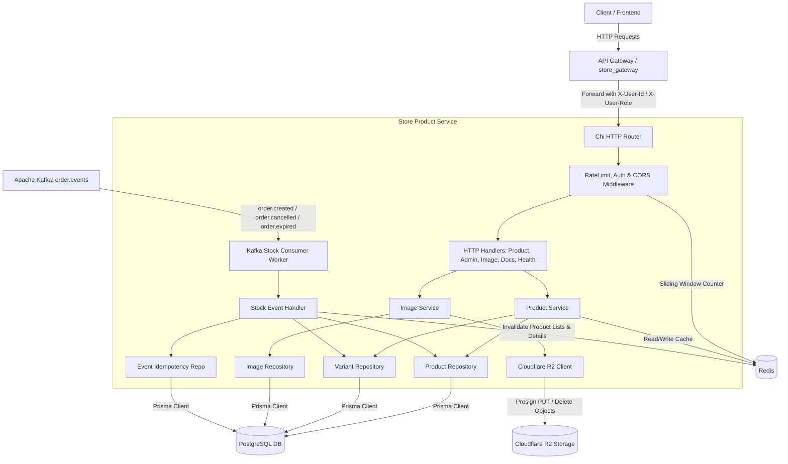
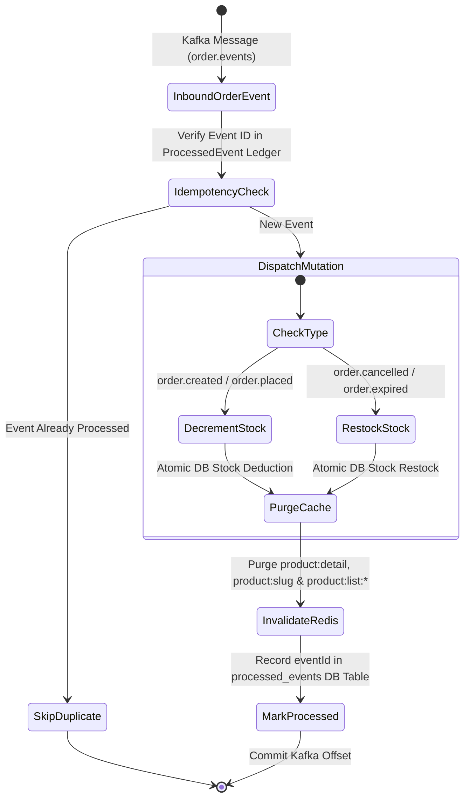
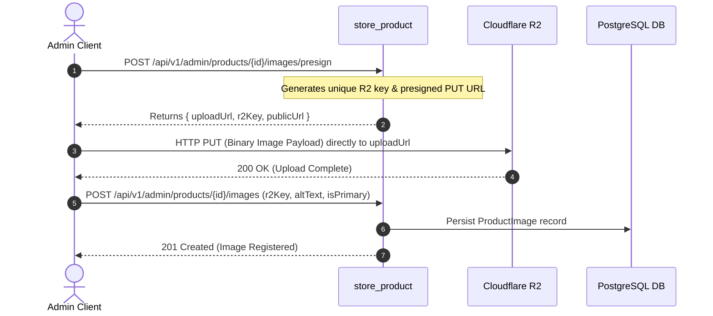

# Store Product Microservice (`store_product`)

[](https://go.dev/)
[](https://github.com/go-chi/chi)
[](https://www.postgresql.org/)
[](https://github.com/steebchen/prisma-client-go)
[](https://kafka.apache.org/)
[](https://redis.io/)
[](https://developers.cloudflare.com/r2/)

A production-grade, event-driven Product Catalog, Inventory, and Media Management microservice built in Go. It manages products, variants, and gallery assets, synchronizes stock availability asynchronously from Kafka order events with database idempotency, serves cached catalog listings via Keyset Cursor pagination, and defends endpoints against volumetric abuse with Redis sliding-window rate limiting.

---

## ?? Table of Contents

- [Architecture Overview](#-architecture-overview)
- [Key Features](#-key-features)
- [Technology Stack](#-technology-stack)
- [Repository Structure](#-repository-structure)
- [Prerequisites & Environment Configuration](#-prerequisites--environment-configuration)
- [Database Setup & Prisma ORM](#-database-setup--prisma-orm)
- [Getting Started (Local Development)](#-getting-started-local-development)
- [API Endpoints & Documentation](#-api-endpoints--documentation)
- [Kafka Event Pipeline & Inventory Synchronization](#-kafka-event-pipeline--inventory-synchronization)
- [Redis Caching & Rate Limiting Rules](#-redis-caching--rate-limiting-rules)
- [Object Storage & Image Upload Workflow](#-object-storage--image-upload-workflow)
- [Testing](#-testing)
- [Docker Deployment](#-docker-deployment)

---

## ?? Architecture Overview



### Event-Driven Inventory Synchronization Flow



---

## ?? Key Features

1. **Event-Driven Inventory Synchronization**: Asynchronously consumes `order.events` (`order.created`, `order.cancelled`, `order.expired`) to execute atomic stock deductions and restocking with strict database idempotency tracking (`ProcessedEvent` ledger).
2. **Direct-to-R2 Presigned Media Uploads**: Facilitates secure, high-throughput image uploads via Cloudflare R2 presigned PUT URLs, eliminating server memory overhead during file transfers.
3. **High-Performance Multi-Tiered Redis Caching**: Caches public catalog listings and detailed product representations with targeted cache key invalidation on catalog mutations or stock adjustments.
4. **Resilient Sliding-Window Rate Limiting**: Redis sliding-window counters protect public catalog (`120 rpm`), search (`60 rpm`), and admin mutation (`30 rpm`) endpoints with an integrated **fail-open** circuit breaker.
5. **Keyset Cursor Pagination**: Public product listings utilize O(1) keyset cursor pagination (`nextCursor`, `hasMore`) for stable performance at scale.
6. **API Gateway Offloading Authentication**: Admin endpoints strictly enforce verified headers (`X-User-Role: admin`, `X-User-Id`) injected upstream by `store_gateway`.
7. **Embedded Interactive Documentation**: OpenAPI 3.1 specifications rendered live via **Scalar UI** (`/docs`) and **Swagger UI** (`/swagger`).

---

## ?? Technology Stack

- **Language**: Go 1.26+
- **HTTP Routing**: [Chi v5](https://github.com/go-chi/chi) with CORS, Logger, & Recovery middlewares
- **ORM & Data Layer**: [Prisma Client Go](https://github.com/steebchen/prisma-client-go) with PostgreSQL / Supabase
- **Event Streaming**: [segmentio/kafka-go](https://github.com/segmentio/kafka-go)
- **Caching & Rate Limiting**: [go-redis/v9](https://github.com/redis/go-redis)
- **Object Storage**: AWS SDK for Go v2 (Cloudflare R2 S3-compatible API)
- **API Documentation**: OpenAPI 3.1, [Scalar UI](https://scalar.com), [Swagger UI](https://swagger.io/tools/swagger-ui/)
- **Containerization**: Multi-stage Alpine Linux Dockerfile

---

## ?? Repository Structure

```
store_product/
+-- cmd/
¦   +-- server/
¦       +-- main.go                 # Application bootstrap & dependency injection
+-- docs/
¦   +-- docs.go                     # Go embed directives for static OpenAPI specs
¦   +-- openapi.json                # OpenAPI 3.1 specification (JSON format)
¦   +-- openapi.yaml                # OpenAPI 3.1 specification (YAML format)
+-- internal/
¦   +-- cache/                      # Redis client & cache key management
¦   +-- config/                     # Environment variable parsing and validation
¦   +-- db/                         # Generated Prisma Client Go engine & models
¦   +-- event/                      # Kafka consumer & stock event handlers
¦   +-- handler/                    # HTTP controllers (Product, Admin, Image, Docs, Router)
¦   +-- middleware/                 # Auth guard, CORS, Logger, Recovery, Rate Limiter
¦   +-- pkg/                        # Keyset cursor pagination and shared utilities
¦   +-- repository/                 # PostgreSQL data access layer (Product, Variant, Image, Event)
¦   +-- service/                    # Business logic, image orchestration & cache invalidation
¦   +-- storage/                    # Cloudflare R2 / S3-compatible object storage client
+-- openspec/                       # OpenSpec specifications and planning artifacts
+-- prisma/
¦   +-- schema.prisma               # Prisma schema definition
+-- Dockerfile                      # Multi-stage container build definition
+-- go.mod / go.sum                 # Go module definitions
+-- .env.example                    # Environment variable configuration template
```

---

## ?? Prerequisites & Environment Configuration

### Prerequisites
- **Go**: Version 1.26 or higher
- **PostgreSQL**: Version 14 or higher (or Supabase instance)
- **Apache Kafka**: Version 3.x+
- **Redis**: Version 7.x+
- **Cloudflare R2 Bucket**: S3-compatible API credentials (or AWS S3)
- **Prisma CLI**: For schema migrations (`npm install -g prisma`)

### Configuration Options (`.env`)

Copy the example configuration file:
```bash
cp .env.example .env
```

| Variable | Type | Default | Description |
| :--- | :--- | :--- | :--- |
| `PORT` | `string` | `8080` | HTTP port for the microservice |
| `ENV` | `string` | `development` | Runtime environment (`development`, `production`, `test`) |
| `DATABASE_URL` | `string` | *(Required)* | PostgreSQL connection URI |
| `REDIS_HOST` | `string` | `localhost` | Redis server hostname or IP address |
| `REDIS_PORT` | `string` | `6379` | Redis server port |
| `REDIS_PASSWORD` | `string` | `""` | Optional password for Redis authentication |
| `REDIS_DB` | `int` | `0` | Redis logical database index |
| `RATE_LIMIT_PUBLIC_RPM` | `int` | `120` | Requests per minute for public catalog queries |
| `RATE_LIMIT_SEARCH_RPM` | `int` | `60` | Requests per minute for search endpoints |
| `RATE_LIMIT_ADMIN_RPM` | `int` | `30` | Requests per minute for admin mutation endpoints |
| `KAFKA_BROKERS` | `string` | `localhost:9092` | Comma-separated list of Kafka broker addresses |
| `KAFKA_TOPIC_ORDER_EVENTS`| `string` | `order.events` | Kafka topic for order lifecycle events |
| `KAFKA_CONSUMER_GROUP` | `string` | `store_product_stock_worker` | Kafka consumer group identifier |
| `R2_ACCOUNT_ID` | `string` | `""` | Cloudflare R2 Account ID for endpoint construction |
| `R2_ACCESS_KEY_ID` | `string` | `""` | Cloudflare R2 / S3 Access Key ID |
| `R2_SECRET_ACCESS_KEY` | `string` | `""` | Cloudflare R2 / S3 Secret Access Key |
| `R2_BUCKET_NAME` | `string` | `store-products` | Cloudflare R2 target bucket name |
| `R2_PUBLIC_BASE_URL` | `string` | `https://cdn.mystore.com` | Public CDN base URL for media delivery |

---

## ?? Database Setup & Prisma ORM

The project uses Prisma schema (`prisma/schema.prisma`) to maintain models and generate the Go client into `internal/db`.

1. **Push Schema to PostgreSQL Database**:
   ```bash
   npx prisma db push --schema=./prisma/schema.prisma
   ```

2. **Generate Go Client**:
   ```bash
   go run github.com/steebchen/prisma-client-go generate --schema=./prisma/schema.prisma
   ```

---

## ?? Getting Started (Local Development)

1. **Clone the repository**:
   ```bash
   git clone https://github.com/Sall-lah/store_product.git
   cd store_product
   ```

2. **Install Go Dependencies**:
   ```bash
   go mod download
   ```

3. **Configure Environment Variables**:
   ```bash
   cp .env.example .env
   # Edit .env to set your DATABASE_URL, REDIS_HOST, KAFKA_BROKERS, and R2 credentials
   ```

4. **Run the Service**:
   ```bash
   go run cmd/server/main.go
   ```

   The service will start listening on `http://localhost:8080`.

5. **Health Check Verification**:
   ```bash
   curl http://localhost:8080/health
   ```

---

## ?? API Endpoints & Documentation

Interactive API documentation is embedded directly in the binary:
- **Scalar UI** *(Modern API Reference)*: [http://localhost:8080/docs](http://localhost:8080/docs)
- **Swagger UI**: [http://localhost:8080/swagger](http://localhost:8080/swagger)
- **OpenAPI 3.1 Specs**: [http://localhost:8080/openapi.json](http://localhost:8080/openapi.json) or `/openapi.yaml`

### Endpoint Catalog

| Group | Method | Path | Auth / Headers | Rate Limit | Description |
| :--- | :--- | :--- | :--- | :--- | :--- |
| **Health** | `GET` | `/health` | None | Unlimited | Service & database liveness probe |
| **Catalog** | `GET` | `/api/v1/products` | None | `120 req/min` | List products with keyset cursor pagination & filters |
| **Catalog** | `GET` | `/api/v1/products/{id}` | None | `120 req/min` | Get single product detail by UUID |
| **Catalog** | `GET` | `/api/v1/products/slug/{slug}` | None | `120 req/min` | Get single product detail by URL slug |
| **Admin Product** | `GET` | `/api/v1/admin/products` | `X-User-Role: admin` | `30 req/min` | Backoffice list all products (including inactive) |
| **Admin Product** | `GET` | `/api/v1/admin/products/{id}` | `X-User-Role: admin` | `30 req/min` | Backoffice get product details with variants & gallery |
| **Admin Product** | `POST` | `/api/v1/admin/products` | `X-User-Role: admin` | `30 req/min` | Create a new product entry |
| **Admin Product** | `PUT` | `/api/v1/admin/products/{id}` | `X-User-Role: admin` | `30 req/min` | Update existing product details |
| **Admin Product** | `DELETE` | `/api/v1/admin/products/{id}` | `X-User-Role: admin` | `30 req/min` | Delete product and cascade delete variants & images |
| **Admin Variant** | `POST` | `/api/v1/admin/products/{id}/variants` | `X-User-Role: admin` | `30 req/min` | Create a product SKU variant with stock & price |
| **Admin Variant** | `PUT` | `/api/v1/admin/products/{id}/variants/{variantId}` | `X-User-Role: admin` | `30 req/min` | Update SKU variant price, stock, size, or color |
| **Admin Variant** | `DELETE` | `/api/v1/admin/products/{id}/variants/{variantId}` | `X-User-Role: admin` | `30 req/min` | Delete product variant |
| **Admin Media** | `POST` | `/api/v1/admin/products/{id}/images/presign` | `X-User-Role: admin` | `30 req/min` | Generate direct-to-R2 presigned PUT upload URL |
| **Admin Media** | `POST` | `/api/v1/admin/products/{id}/images` | `X-User-Role: admin` | `30 req/min` | Register uploaded R2 image in database catalog |
| **Admin Media** | `GET` | `/api/v1/admin/products/{id}/images` | `X-User-Role: admin` | `30 req/min` | List product gallery images |
| **Admin Media** | `PUT` | `/api/v1/admin/products/{id}/images/{imageId}` | `X-User-Role: admin` | `30 req/min` | Update image alt text, sort order, or primary flag |
| **Admin Media** | `DELETE` | `/api/v1/admin/products/{id}/images/{imageId}` | `X-User-Role: admin` | `30 req/min` | Delete image record and purge object from R2 |

---

## ?? Kafka Event Pipeline & Inventory Synchronization

The service consumes order lifecycle events to maintain real-time inventory levels without synchronous coupling between microservices.

### Inbound Consumer Configuration

- **Kafka Topic**: `order.events` (configured via `KAFKA_TOPIC_ORDER_EVENTS`)
- **Consumer Group**: `store_product_stock_worker` (configured via `KAFKA_CONSUMER_GROUP`)

### Event Schemas & Actions

| Event Type | Trigger Condition | Action in `store_product` | Cache Invalidation |
| :--- | :--- | :--- | :--- |
| `order.created` / `order.placed` | Customer places order | Atomically decrements variant `stock` in PostgreSQL | Purges `product:detail:<id>`, `product:slug:<slug>`, and `product:list:*` |
| `order.cancelled` / `order.canceled` | Order cancelled by user/admin | Atomically increments (restocks) variant `stock` in PostgreSQL | Purges `product:detail:<id>`, `product:slug:<slug>`, and `product:list:*` |
| `order.expired` | Payment window timed out | Atomically increments (restocks) variant `stock` in PostgreSQL | Purges `product:detail:<id>`, `product:slug:<slug>`, and `product:list:*` |

### Idempotency Guarantee (`processed_events`)

To defend against duplicate message delivery from Kafka's at-least-once guarantee, each event ID is verified against the `ProcessedEvent` table before applying mutations. Upon successful stock update, the event ID and timestamp are recorded within the same transaction.

---

## ?? Redis Caching & Rate Limiting Rules

### Caching Strategy
- **Product Detail**: Cached under `product:detail:<id>` and `product:slug:<slug>` with TTL.
- **Product Lists**: Keyset cursor paginated queries cached under `product:list:<hash>`.
- **Targeted Cache Invalidation**: Catalog updates, variant mutations, or Kafka inventory sync events trigger automatic Redis cache purging.

### Rate Limiting Policies

| Scope / Route Group | Limit | Window | Key Strategy |
| :--- | :--- | :--- | :--- |
| **Public Catalog (`/api/v1/products/*`)** | 120 req | 1 minute | Client IP |
| **Catalog Search** | 60 req | 1 minute | Client IP |
| **Admin Operations (`/api/v1/admin/*`)** | 30 req | 1 minute | `X-User-Id` or Client IP |

### Resilience & Degraded Headers
- **Fail-Open Policy**: If Redis is unreachable or experiences latency spikes, requests pass through uninterrupted to avoid taking down the product catalog.
- **Response Headers**:
  - `X-RateLimit-Limit`: Maximum requests permitted within the window.
  - `X-RateLimit-Remaining`: Remaining request quota.
  - `X-RateLimit-Reset`: Unix timestamp when quota replenishes.

---

## ?? Object Storage & Image Upload Workflow

To avoid piping heavy image binaries through the application server, media uploads follow a 3-tier presigned workflow:



---

## ?? Testing

Execute unit and integration test suites:

```bash
# Run all test packages
go test -v ./...

# Run test suite with race detector and code coverage
go test -race -cover ./...
```

---

## ?? Docker Deployment

A production-ready, multi-stage Alpine Dockerfile is included:

1. **Build Container Image**:
   ```bash
   docker build -t store_product:latest .
   ```

2. **Run Container**:
   ```bash
   docker run -d \
     --name store_product \
     -p 8080:8080 \
     --env-file .env \
     store_product:latest
   ```

3. **Check Container Health**:
   ```bash
   docker inspect --format='{{json .State.Health}}' store_product
   ```
